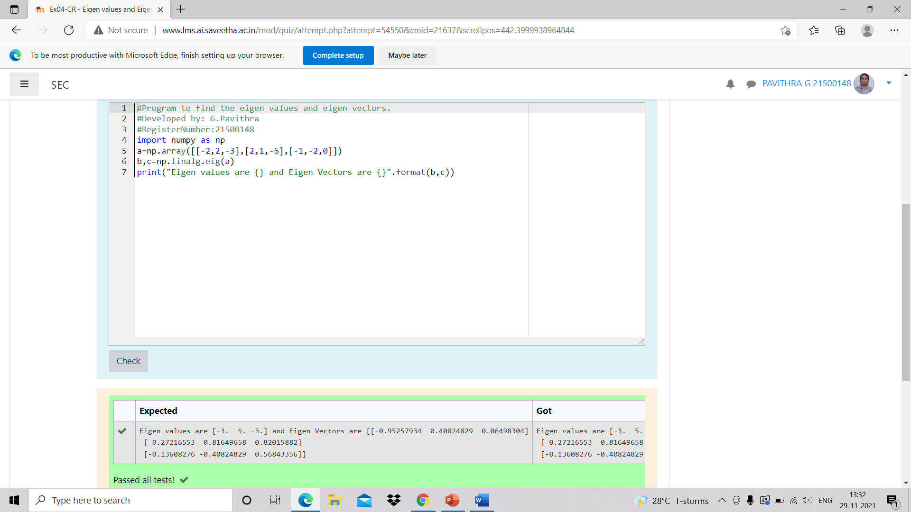

# EIGENVALUES-AND-EIGENVECTORS
## Aim:
To write a python program to find the Eigenvalues and Eigen Vectors
## Equipment’s required:
1. 	Hardware – PCs
2. 	Anaconda – Python 3.7 Installation / Moodle-Code Runner
## Algorithm:
### Step1 : 
### Step 2: 
### Step 3: Using the np.linalg.eig(),  we get two results (first is eigenvalue and second is eigenvector) of the given matrix.
### Step 4: 

## Program:
~~~
import numpy as np
a=np.array([[-2,2-3],[2,1,-6],[-1,-2,0]])
b,c=np.linalg.eig(a)
print("Eigen values are {} and Eigen vectors {}".format(b,c))
~~~
## Output:

## Result:
Thus the Eigenvalue and Eigenvector is successfully solved using python program
